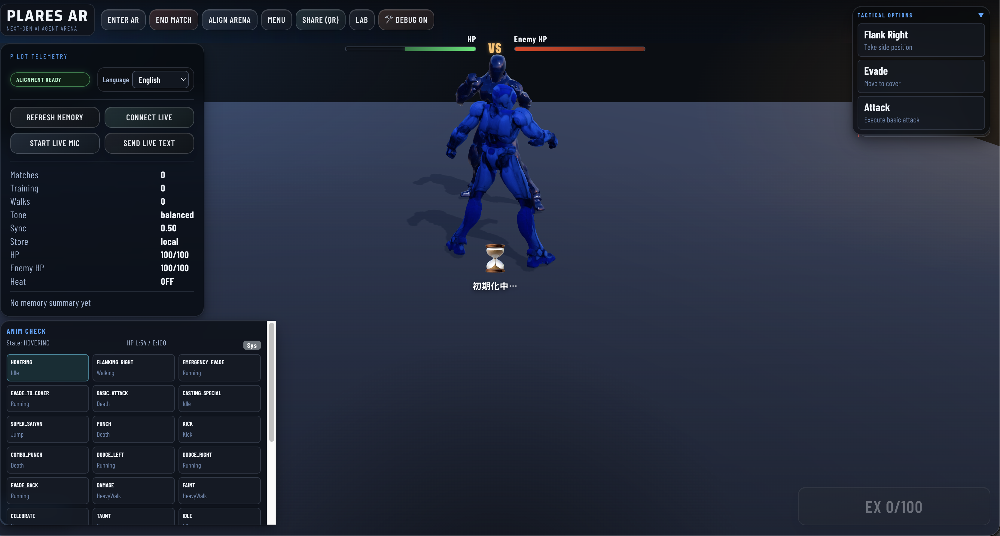
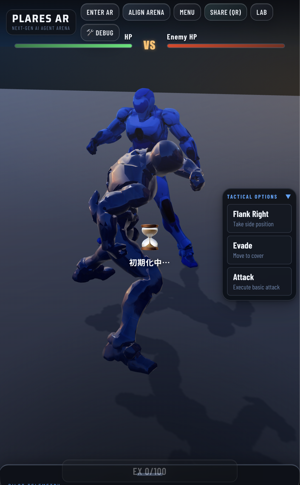

# plARes: Living WebAR AI 🤖✨

**plARes** (pronounced "players") is a next-generation AR action game where your AI-driven robot character lives, evolves, and battles in the real world. Leveraging **Gemini Multimodal Live API**, it fuses high-speed WebXR action with deep emotional AI interactions.

---

## 🌟 Vision

"Beyond the screen, into your room."  
plARes aims to create a virtual lifeform that recognizes your environment, understands your voice, and evolves its personality and appearance based on real-world experiences.

---

## 🚀 Key Features

- **Gemini Live Integration**: Bidirectional voice/video streaming for zero-latency AI commentary and strategic judging.
- **WebXR AR Combat**: No app installation required. Battle in your living room directly from your browser.
- **Dynamic Evolution**: Robot appearance (textures, scars) and personality shift based on battle history and training.
- **Real-world Crafting**: Use camera scans of real objects to generate 3D equipment using Imagen 3.
- **Multiplayer Sync**: Ultra-low latency P2P Data Channels (WebRTC) for competitive action.

---

## 📚 Documentation Guide

We maintain comprehensive design documentation in both **English** and **Japanese**.

### 📖 [Master Design Specifications (ENG)](docs/master_design.md)

The central hub for all technical and game design documents.

### 📖 [開発マスター設計仕様書 (JPN)](docs/jp/master_design.md)

全ての設計・技術資料へのポータルとなる日本語版マスタードキュメント。

---

## 🛠 Tech Stack

- **Frontend**: React, Three.js (React Three Fiber), WebXR, WebRTC.
- **Backend**: Python (FastAPI), Google ADK (Agent Development Kit), Gemini 1.5/2.0 API.
- **Infrastructure**: Google Cloud Run, Firestore, Firebase Realtime DB, MediaPipe.

---

## ⚖️ License

Project plARes is developed under the MIT License. AI-generated assets and CC0 pipeline rules ensure a commercially viable and safe content ecosystem.

---

> _Empowered by Google DeepMind's Advanced Agentic Coding._
