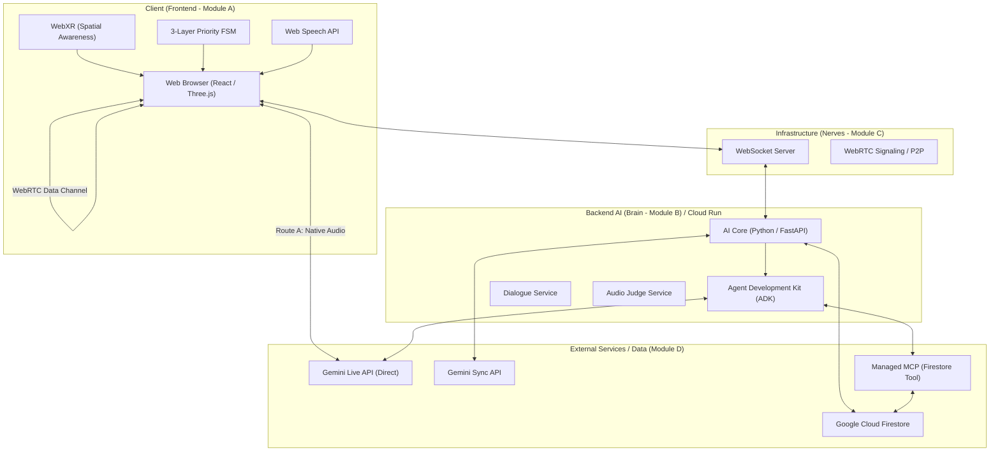

# System Architecture

The architecture diagram mentioned is located at [overview.png](file:///Users/you/code/plaresAR/docs/overview.png) and the game flow diagram is at [flow.png](file:///Users/you/code/plaresAR/img/flow.png).

## Mermaid Diagram

