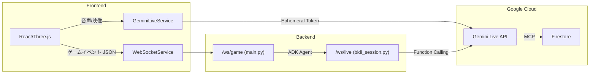

# Gemini Live API 接続アーキテクチャ（確定版）

最終更新: 2026-03-01

## 概要

本プロジェクトには2つの Gemini Live API 接続経路が存在する。
それぞれ用途が異なるため**並存は正しい設計**であり、混同を防ぐために本書で役割を明確化する。

## 経路定義

### Path A: フロント直結（本番プライマリ）

```
スマホ → GeminiLiveService.ts → Ephemeral Token → Gemini Live API
```

| 項目       | 値                                                         |
| ---------- | ---------------------------------------------------------- |
| ファイル   | `frontend/src/services/GeminiLiveService.ts`               |
| プロトコル | WebSocket（Gemini SDK内部）                                |
| 認証       | Ephemeral Token（バックエンド `/ws/game` で発行）          |
| 用途       | **リアルタイム音声入出力**（Native Audio）、滑舌判定、実況 |
| レイテンシ | 最低（バックエンド中継なし）                               |
| モデル     | `gemini-2.5-flash-native-audio-preview-12-2025`            |

### Path B: バックエンド中継（ADKエージェント用）

```
スマホ → WebSocket /ws/live → bidi_session.py → ADK Runner → Gemini Live API
```

| 項目       | 値                                                                             |
| ---------- | ------------------------------------------------------------------------------ |
| ファイル   | `backend/ai_core/streaming/bidi_session.py`                                    |
| プロトコル | WebSocket → ADK Runner Bidi-streaming                                          |
| 認証       | サーバーサイド Service Account                                                 |
| 用途       | **ADKエージェント機能**（Function Calling、MCP Toolアクセス、Memory Bank検索） |
| レイテンシ | 中（バックエンド経由）                                                         |
| モデル     | 環境変数 `PLARES_EPHEMERAL_MODEL`                                              |

## 使い分けルール

| シーン                                  | 経路   | 理由                                   |
| --------------------------------------- | ------ | -------------------------------------- |
| 詠唱音声のリアルタイム送信              | Path A | 最低レイテンシが必須                   |
| 滑舌判定（3軸スコア算出）               | Path A | Native Audio直接入力が必要             |
| 実況ボイス生成                          | Path A | TTS音声のストリーミング再生            |
| AI自律ツール呼び出し（Firestore検索等） | Path B | ADK Function Calling が必要            |
| 勝者インタビュー生成                    | Path B | Memory Bank参照 + テキスト生成         |
| 散歩モードのVisionトリガー              | Path A | カメラ映像のリアルタイムストリーミング |

## 禁止事項

- **WebSocket (`/ws/game`) に音声バイナリを相乗りさせてはならない**（Doc.10 §4 準拠）
  - Head-of-Line Blocking によりゲームイベント遅延が発生するため
- Path A と Path B を同一セッション内で同時接続しても良いが、音声データは必ず Path A のみを使用すること

## 図解


