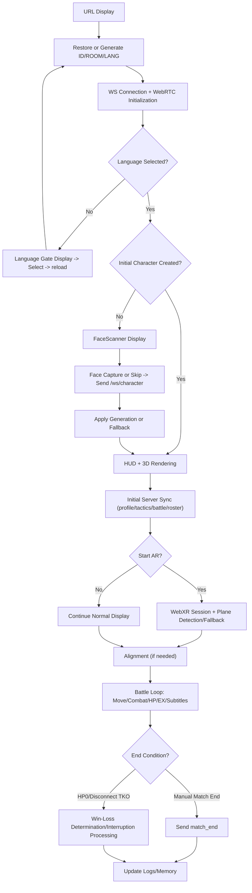

# plARes Game Flow Specification, Access Audit, and Expansion Implementation Plan

[日本語版 (JP)](jp/game_flow_spec_and_mode_plan.md)

Last Updated: 2026-03-01
Target: Current Implementation (frontend/backend mainline)

## 1. Purpose

This document is a specification that organizes the following:

- Transition specification from URL display to game end (current)
- Audit of accessible/inaccessible features in the current UI
- Implementation plan for functional extensions including Training/Walk modes

## 2. Current Transition Flow (URL Display to End)

## 3. Current Access Audit (Buttons/Flows)

| Feature                      | Current Flow                        | Accessibility              | Remarks                                                   |
| ---------------------------- | ----------------------------------- | -------------------------- | --------------------------------------------------------- |
| Language Selection           | Initial Gate + Selection in Profile | Yes                        | Blocks screen interaction if initial gate is not passed   |
| Character Creation           | FaceScanner (First time)            | Yes                        | Continues with fallback even on error                     |
| Start AR                     | Header `Start AR`                   | Yes (on supported devices) | Displays "disabled" if unsupported                        |
| Alignment                    | Header `Alignment`                  | Yes                        | Practically required for matches                          |
| Tactics Commands             | Tactics Option Buttons              | Yes                        | Restricted effect if `matchAlignmentReady` is not reached |
| Special Move (EX)            | Bottom `EX ... / Special` Button    | Conditional                | EX full + Alignment complete + Not paused                 |
| Voice Commands               | Continuous Voice Recognition        | Conditional                | Requires Mic permission + Alignment complete              |
| LIVE Connection/Mic/Text     | Inside Profile Panel                | Yes                        | Requires opening the panel                                |
| End Match                    | Header `End Match`                  | Conditional                | Only visible when `debugVisible=true`                     |
| Memory Update (profile sync) | `Update Memory` in Profile          | Yes                        | Sends `request_profile_sync`                              |
| Training Count Display       | Profile Grid                        | Yes                        | Display only                                              |
| Walk Count Display           | Profile Grid                        | Yes                        | Display only                                              |
| Start Training               | No dedicated button                 | No                         | Backend endpoint exists                                   |
| Start Walk                   | No dedicated button                 | No                         | Backend endpoint exists                                   |
| Send Training Complete       | No dedicated flow                   | No                         | UI to send `training_complete` not implemented            |
| Send Walk Complete           | No dedicated flow                   | No                         | UI to send `walk_complete` not implemented                |
| Walk Vision Trigger          | No dedicated flow                   | Practically No             | Sender for `walk_vision_trigger` not implemented          |

## 4. Current Gaps (To be addressed)

1. Training/Walk only shows aggregate counts; play flows are missing.
2. No UI actions to trigger `training_complete` / `walk_complete` events.
3. Missing frontend implementation to fire `walk_vision_trigger`, so walk-specific reaction flows are inactive.
4. Match ending depends on debug mode, which is weak for production.
5. Mode state (`match/training/walk`) is not explicitly managed on the frontend, making the current context unclear to the user.

## 5. Expansion Implementation Plan (Including Training/Walk)

### Phase 1: Frontend Flow Addition (High Priority)

Goal: Enable users to start and complete Training/Walk modes using only the UI.

- Add mode toggle buttons for `Match / Training / Walk` in the HUD or Profile.
- Add `Start Training` / `Complete Training` buttons.
- Add `Start Walk` / `Complete Walk` buttons.
- Always display the current mode (e.g., `MODE: TRAINING`).
- Remove `End Match` dependency on debug mode and display it in the normal flow (position TBD).

### Phase 2: Event Contract & Transmission Implementation

Goal: Correcty connect frontend operations to backend endpoints.

- Send `buff_applied` + `kind=training_complete` (Connect to existing endpoint).
- Send `buff_applied` + `kind=walk_complete` (Connect to existing endpoint).
- Standardize payloads for `sessionId` / `score` / `routeSummary`, etc.
- Implement conditions to send `walk_vision_trigger` based on environmental changes during walks (with throttling).

### Phase 3: Backend Preparation (Maintaining Compatibility)

Goal: Ensure robustness against invalid payloads/rapid firing and stabilize log quality.

- Strengthen validation for `training_complete` / `walk_complete` payloads.
- Prevent duplicate completions for the same `sessionId` (Idempotency).
- Store `mode` toggle events (optional) for future analysis.
- Add "Current Mode" and "Ongoing Session" info to `profile_sync` (optional).

### Phase 4: UX and Verification

Goal: Ensure smooth flows and quality for practical use.

- Mode-specific tutorial subtitles (displayed once at the start).
- Add e2e tests for `training_complete` / `walk_complete` transmission and count increment verification.
- Log observability: Display failure causes briefly on the HUD.

## 6. Acceptance Criteria (DoD)

- Training/Walk start/complete operations are possible via UI.
- Completion operations increase `total_training_sessions` / `total_walk_sessions` in the backend profile.
- Counts are maintained after reload.
- Mode display matches actual event transmission.
- Existing match flow (AR, Special Moves, Sync) remains unaffected.

## 7. Proposed Implementation Order

1. Phase 1 (Flows)
2. Phase 2 (Transmission)
3. Phase 3 (Robustness)
4. Phase 4 (Tuning/e2e)

This order ensures that "usable Training/Walk" features are delivered as quickly as possible, followed by quality improvements.
