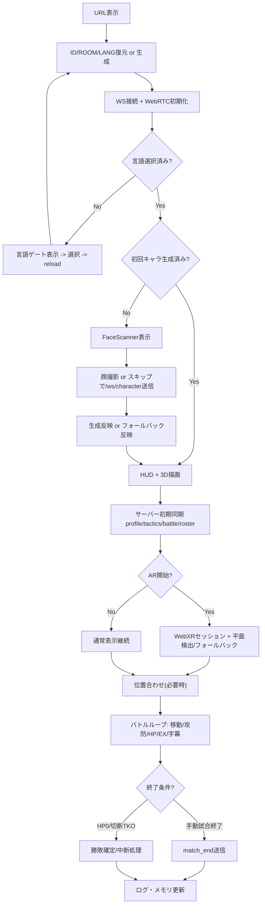

# plARes ゲーム遷移仕様・アクセス監査・拡張実装計画

[English Version (EN)](../game_flow_spec_and_mode_plan.md)

最終更新: 2026-03-01
対象: 現行実装（frontend/backend mainline）

## 1. 目的

本書は、以下を一体で整理する仕様図書です。

- URL表示からゲーム終了までの遷移仕様（現行）
- 現行UIでアクセス可能/不可の監査
- 修行/散歩を含む機能拡張の実装計画

## 2. 現行の一連遷移（URL表示〜終了）

## 3. 現行アクセス監査（ボタン/導線）

| 機能                     | 現行導線                            | アクセス可否     | 備考                                       |
| ------------------------ | ----------------------------------- | ---------------- | ------------------------------------------ |
| 言語選択                 | 初回ゲート + プロファイル内セレクト | 可               | 初回ゲート未通過だと画面操作を遮る         |
| キャラ生成               | FaceScanner（初回）                 | 可               | エラー時もフォールバックで継続             |
| AR開始                   | ヘッダ `AR開始`                     | 可（端末対応時） | 非対応時はdisabled表示                     |
| 位置合わせ               | ヘッダ `位置合わせ`                 | 可               | 対戦時に事実上必須                         |
| 戦術コマンド             | 戦術オプションボタン群              | 可               | `matchAlignmentReady` 未達時は効果制限あり |
| 必殺発動                 | 下部 `EX ... / 必殺` ボタン         | 可（条件付き）   | EX満タン + 位置合わせ完了 + 非pause        |
| 音声コマンド             | 常時音声認識                        | 可（条件付き）   | マイク権限 + 位置合わせ完了が必要          |
| LIVE接続/マイク/テキスト | プロファイルパネル内                | 可               | パネルを開く必要あり                       |
| 試合終了                 | ヘッダ `試合終了`                   | 条件付き可       | `debugVisible=true` 時のみ表示             |
| 記憶更新(profile sync)   | プロファイル内 `記憶を更新`         | 可               | request_profile_sync 送信                  |
| 修行カウント表示         | プロファイルグリッド                | 可               | 表示のみ                                   |
| 散歩カウント表示         | プロファイルグリッド                | 可               | 表示のみ                                   |
| 修行開始                 | 専用ボタンなし                      | 不可             | backend受け口は存在                        |
| 散歩開始                 | 専用ボタンなし                      | 不可             | backend受け口は存在                        |
| 修行完了送信             | 専用導線なし                        | 不可             | `training_complete` を送るUI未実装         |
| 散歩完了送信             | 専用導線なし                        | 不可             | `walk_complete` を送るUI未実装             |
| walk vision trigger      | 専用導線なし                        | 実質不可         | `walk_vision_trigger` の送信元未実装       |

## 4. 現行ギャップ（要対応）

1. 修行/散歩は「集計表示のみ」で、プレイ導線が欠落。
2. `training_complete` / `walk_complete` イベントを発火するUI操作がない。
3. `walk_vision_trigger` を発火するフロント実装がないため、散歩向けリアクション導線が死んでいる。
4. 試合終了がデバッグ依存で、本番導線としては弱い。
5. モード状態（`match/training/walk`）がフロントで明示管理されておらず、現在の文脈がユーザーに伝わりにくい。

## 5. 拡張実装計画（修行/散歩を含む）

### Phase 1: フロント導線追加（最優先）

目的: ユーザーがUIだけで修行/散歩を開始・完了できる状態にする。

- HUDまたはプロファイル内に `試合 / 修行 / 散歩` モード切替ボタンを追加。
- `修行開始` / `修行完了` ボタンを追加。
- `散歩開始` / `散歩完了` ボタンを追加。
- 現在モードを常時表示（例: `MODE: TRAINING`）。
- `試合終了` を debug依存から外し、通常導線にも表示（表示位置は要調整）。

### Phase 2: イベント契約・送信実装

目的: フロント操作をbackend受け口に正しく接続する。

- `buff_applied` + `kind=training_complete` を送信（既存受け口接続）。
- `buff_applied` + `kind=walk_complete` を送信（既存受け口接続）。
- `sessionId` / `score` / `routeSummary` 等のpayload標準化。
- 散歩中の環境変化で `walk_vision_trigger` を送る条件を実装（間引きあり）。

### Phase 3: backend整備（互換維持）

目的: 不正payloadや連打に強く、ログ品質を安定化。

- `training_complete` / `walk_complete` payloadのバリデーション強化。
- 同一 `sessionId` の重複完了防止（idempotent化）。
- `mode` 切替イベント（任意）を保存し、後続分析可能にする。
- profile_syncへ「現在モード」「進行中セッション」情報を追加（任意）。

### Phase 4: UXと検証

目的: 実運用で混乱しない導線と品質担保。

- モード別チュートリアル字幕（開始時に1回表示）。
- e2eに `training_complete` / `walk_complete` 送信・カウント増分検証を追加。
- ログ可観測性: 失敗時原因をHUD短文で表示。

## 6. 受け入れ条件（DoD）

- UI上で修行/散歩の開始・完了操作が可能。
- 完了操作で backend profile の `total_training_sessions` / `total_walk_sessions` が増加。
- 再読み込み後もカウントが維持される。
- モード表示と実際のイベント送信が一致。
- 既存の試合フロー（AR、必殺、同期）を壊さない。

## 7. 実装順の提案

1. Phase 1（導線）
2. Phase 2（送信）
3. Phase 3（堅牢化）
4. Phase 4（チューニング/e2e）

この順序により、最短で「使える修行/散歩」を先に提供し、その後に品質を上げられます。
